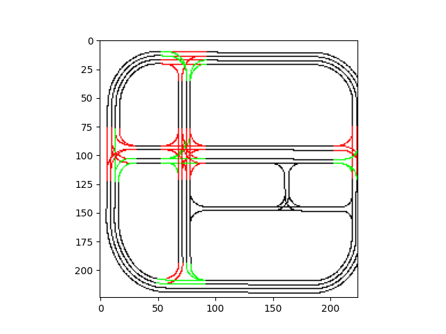

# MLTrafficCARLA

Data-driven traffic generator based on the deep learning models from [this repo](https://github.com/PabloVD/TrafficTrainer).

To use it, start a CARLA simulation and run `python3 run_nn_traffic.py`.

